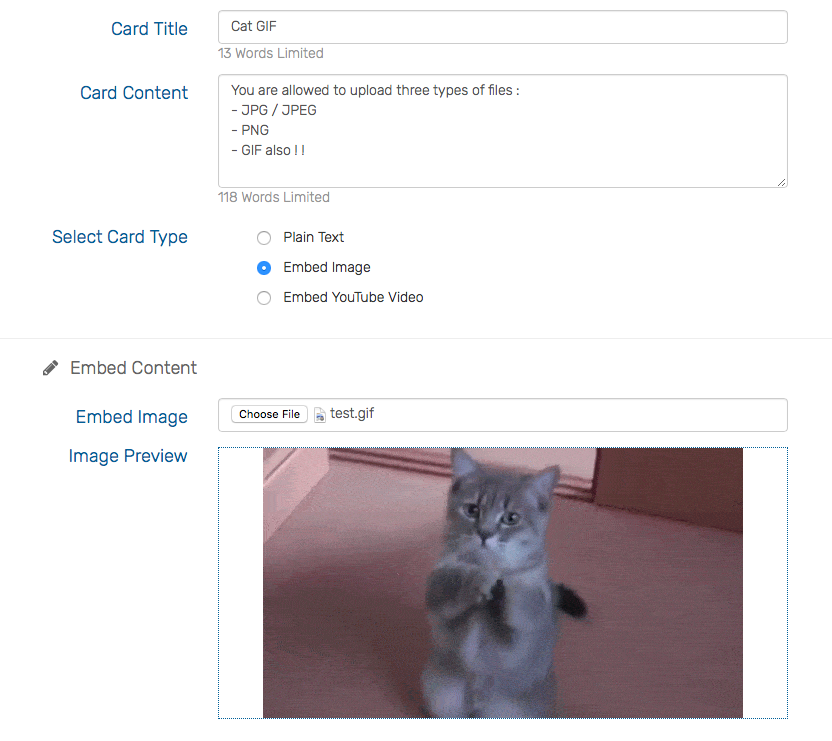

## Scrumby Board
An application for managing projects and tracking task process <br>
Project created at 2016/9/25 22:30 <br>
Website : Currently Not Released in Public <br>
Version : Ver 1.0.2 <br>

## Speculations
- Scrumby Project Tracking(Main) / Scrumby Posts(Continued) 
- **User authentication / Cryto : SHA1 (Completed)**
- Database Schema Design
- CronJob : In order to backup the data
- **Able to upload / download images / videos (Completed)**
- Able to upload / download media files
- History Record
- **Able to add new Project Tracking Board (Completed)**
- Able to drag & drop tracking card (item)
- Able to leave comments and votes to each tracking card
- Able to use Tarot for project tracking(Continued)
+ Need to have calender in each scrumby board project (New feature)
- **Able to have Gantt Chart Feature (Completed)**
+ Able to customize theme (New feature)

## Tools
```
Web Framework: PHP CodeIgniter3
Version Control: Git, GitLab
Database: MySQL
Add Plugins or Features: {
  CodeIgniter Simplicity Master: Asset system for PHP CodeIgniter Framework
  jQuery:             A simplified and agile JavaScript library
  React.js:           Main view UI arrangement
  Sortable.js:        Drag and drop
  Sweet Alert:        A well formatted pop out alert UI
  Bootstrap 3:        Responsive
  Font-Awesome Icons: A collection of icons
  Datatable:          display history records
}
```

## Page Flow Design


## Page Design & UI

### Main Page Info


### Gantt Chart Feature


### Card Form


### Image Upload


### Youtube Upload


### Card Detail View


### Popout Detail


### Play Youtube

